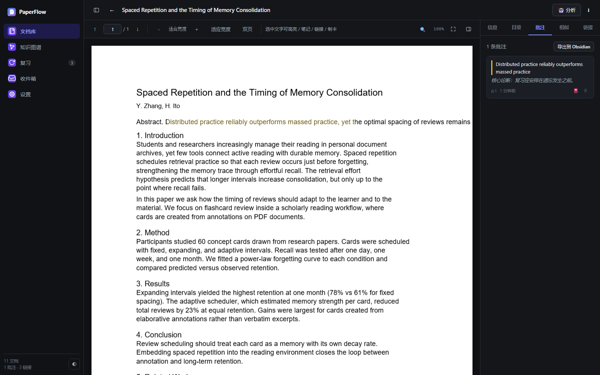
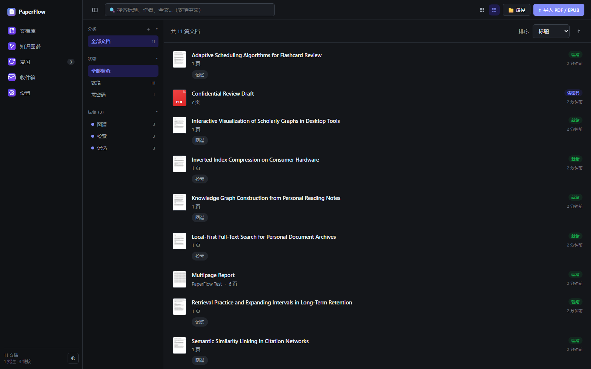
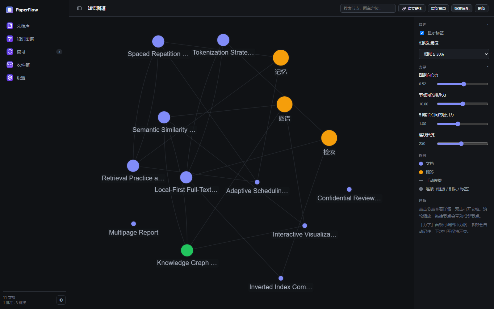
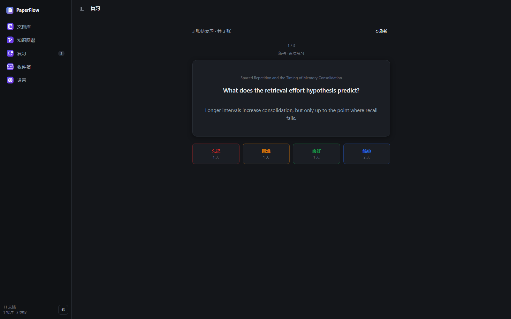
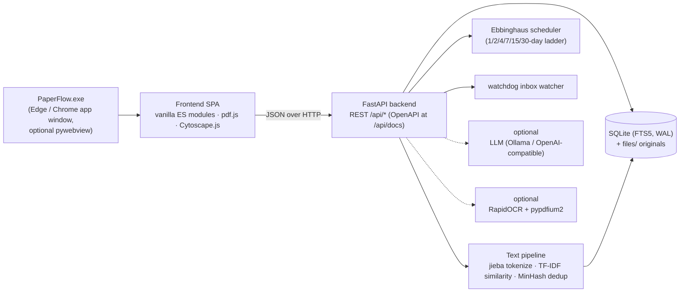

<div align="center">

# PaperFlow

**本地优先的学术文献管理器 —— 阅读 · 检索 · 关联 · 记忆**

[](https://github.com/luzhijintou/paperflow/releases/latest)
[](LICENSE)
[](https://github.com/luzhijintou/paperflow/releases/latest)
[](https://www.python.org/)
[](https://github.com/luzhijintou/paperflow/stargazers)

[简体中文](./README.md) | [English](./README_EN.md)

*无需安装、无需注册、无需联网 —— 文献的阅读、检索、批注、复习与知识关联，全部发生在一台笔记本电脑上。*



</div>

---

## 目录

- [1. 这是什么](#1-这是什么)
- [2. 与常见文献工具的定位对比](#2-与常见文献工具的定位对比)
- [3. 核心功能](#3-核心功能)
- [4. 快速开始](#4-快速开始)
- [5. 推荐的学术工作流](#5-推荐的学术工作流)
- [6. 系统架构](#6-系统架构)
- [7. 隐私与数据主权](#7-隐私与数据主权)
- [8. FAQ](#8-faq)
- [9. 已知限制](#9-已知限制)
- [10. 参与贡献](#10-参与贡献)
- [11. 许可证](#11-许可证)

---

## 1. 这是什么

PaperFlow 是一个**本地优先（local-first）**的文献管理器：把导入的每一篇 PDF / EPUB 变成可全文检索、可批注、可复习、可在知识图谱中互相关联的节点。它不追求替代 Zotero 的引文排版能力，而是回答一个更基本的问题：

> 当你把论文存进文件夹之后，**读过的东西如何被找到、被记住、被再次想起？**

围绕这个问题，PaperFlow 内置了一条完整的阅读闭环：

| 能力 | 说明 |
| --- | --- |
| **管理** | PDF / EPUB 导入（拖拽、路径、文件夹监控）、封面网格视图、集合 / 标签 / 查重 |
| **检索** | SQLite FTS5 倒排索引 + jieba 中文分词，标题 / 作者 / 摘要 / 正文一并命中，毫秒级响应 |
| **阅读** | pdf.js 渲染的 PDF 阅读器与按章阅读的 EPUB 阅读器，竖向滚动 / 横向翻页 |
| **批注** | 选中即高亮（4 色）、笔记、**文档间双向链接**、一键制卡 |
| **关联** | TF-IDF 语义相似度自动推荐相关文献；Obsidian 风格力导向知识图谱 |
| **记忆** | 基于**艾宾浩斯遗忘曲线**的按天间隔重复排程（1 / 2 / 4 / 7 / 15 / 30 天阶梯） |
| **整理** | 可视化 if-then 规则引擎、SHA-256 / MinHash 智能去重、AI 摘要与打标（可选，支持全本地） |
| **带走** | 全库 JSON、单篇 Markdown、Obsidian、Anki 一键导出；完整 REST API |

所有数据（SQLite 数据库 + 原文件副本）保存在本地一个 `data/` 目录中；应用可以完全离线运行，不注册账号、无遥测、无云端依赖。

## 2. 与常见文献工具的定位对比

下表为诚实的定位对比，而非"取代声明"——PaperFlow 刻意不做引文样式排版（见[已知限制](#9-已知限制)）。

| 维度 | PaperFlow | 云端文献管理器（Zotero / EndNote 等） |
| --- | --- | --- |
| 数据位置 | 本地 `data/` 目录，复制即备份 | 本地库 + 云同步（需注册账号） |
| 离线可用 | ✅ 完全离线，无任何网络依赖 | 多数可离线，同步 / 账号需联网 |
| 中文全文检索 | ✅ jieba 分词 + FTS5，开箱即用 | 支持，中文分词质量与配置因工具而异 |
| 知识图谱 | ✅ 内置（文档–标签–链接–相似四类关系） | 通常需插件（如 Zotero Graph） |
| 间隔重复复习 | ✅ 内置艾宾浩斯按天排程 | ❌ 通常无（需外部 Anki + 插件） |
| Obsidian / Anki 导出 | ✅ 内置 | 需插件 |
| 扫描件 OCR | ✅ 可选组件，设置页一键安装 | ❌ 通常需外部工具 |
| AI 摘要 / 打标 | ✅ 可选，支持 Ollama 全本地运行 | 部分支持，多依赖云服务 |
| 账号 / 遥测 | 无 | 需要账号 |
| 引文样式 / Word 插件 | ❌ 不在范围内 | ✅ 核心能力 |
| 价格 | 免费开源（MIT） | Zotero 免费（存储收费）/ EndNote 收费 |

**一句话定位**：需要严格的引文管理与协作，用 Zotero；想要一个**只属于自己、不开账号、读过的每一段话都能被检索和复习**的私人文献工作台，试试 PaperFlow。

## 3. 核心功能

### 3.1 文档库

- **导入**：拖拽 / 文件选择 / 从路径导入，或把 PDF 丢进受监控的收件箱文件夹（watchdog + 去抖动），新文件自动导入并建立索引
- **加密 PDF**：带打开口令的 PDF 照常导入并标记「需密码」，阅读器中输入密码即可阅读；勾选「记住密码」（仅保存在本机数据库）后自动建立全文索引，OCR 同样可用
- **封面网格 / 列表双视图**：列表显示高清封面（PDF 第一页 / EPUB 内嵌封面）、作者、年份、页数、导入时间
- **集合 / 标签 / 状态筛选**，按导入时间、标题、作者等排序
- **智能去重**：SHA-256 精确去重 + MinHash 近似重复 + 标题相似版本建议，收件箱内一键合并



### 3.2 中文全文检索

- SQLite **FTS5** 倒排索引，`jieba` 对中文做词典分词，中英混排文档同样可查
- 标题、作者、关键词、摘要、正文一并索引，命中片段高亮
- 纯本地索引：10,000 篇规模的库，查询中位延迟在毫秒量级，边输入边出结果

### 3.3 精读批注

- **选中文字即操作**：高亮（4 色）、写笔记、建立到另一篇文献的**双向链接**、生成复习卡片
- 批注汇总视图可搜索；批注随单篇 Markdown / Obsidian 导出一并带走
- 扫描版 PDF 经本地 OCR 后，识别文本以**透明文字层**叠加在原页上，可直接选中与批注（体验与商业阅读器一致）


### 3.4 知识图谱

- 文档、标签为节点；**引用式双向链接、TF-IDF 语义相似、标签共现**为边
- Obsidian 风格力导向布局（Cytoscape.js + fcose）：节点按连接度缩放，hover 聚焦邻域，其余淡出；标签随缩放自适应显隐
- 相似度阈值滑杆（15% / 30% / 50%）实时增删边；按标题 / 标签搜索可回车定位节点
- 双击节点直接跳转阅读



### 3.5 艾宾浩斯间隔复习

- 从批注或选区一键生成卡片；卡片按**遗忘曲线**排程：固定日间隔阶梯 `1 → 2 → 4 → 7 → 15 → 30` 天
- 评分四档：**简单**跳一档、**良好**按阶梯推进、**困难**原地重复、**忘记**回到第 1 天；走完阶梯后按 ease 因子自适应延长
- 每次评分实时预览"下次复习时间"；顶部导航常驻**待复习计数**



### 3.6 自动化与可选智能

- **规则引擎**：可视化 if-then 编辑器（条件：正文 / 文件名 / 标题 / 标签 / 年份 / 类型 / 页数…；动作：打标签 / 归类 / 重命名 / 触发分析），导入时自动生效
- **AI 摘要 / 元数据 / 打标**（可选）：任何 OpenAI 兼容接口——Ollama 全本地、DeepSeek、OpenAI 均可；未配置时功能静默降级，不影响其它能力
- **本地 OCR**（可选）：设置页一键安装 pypdfium2 + RapidOCR（含中文模型）到 `data/pylibs`，无需命令行、无需重启；流式分批识别，内存占用恒定（300+ 页扫描书峰值 ~1 GB）

### 3.7 开放数据

- **全库导出** JSON；**单篇导出** Markdown（含 frontmatter / 摘要 / 批注 / 双向链接）
- **导出 Obsidian**：笔记间 `[[wikilink]]` 互联，直接落入你的 vault
- **导出 Anki**：经 AnkiConnect 推送到指定牌组
- **完整 REST API**：自带 OpenAPI 文档（`/api/docs`），支持可选 API Key 鉴权与事件 Webhook

## 4. 快速开始

### 4.1 Windows 安装包（推荐）

1. 前往 [**Releases**](https://github.com/luzhijintou/paperflow/releases/latest) 下载 `PaperFlow-win64-*.zip`
2. 解压到任意位置（如 `D:\PaperFlow`）
3. 双击 `PaperFlow.exe`

> 首次运行如出现 SmartScreen 提示：点「更多信息 → 仍要运行」。应用未做代码签名（见[已知限制](#9-已知限制)）。

- **系统要求**：Windows 10 / 11（64 位）。默认桌面窗口使用系统自带的 Microsoft Edge（app 模式），无需额外依赖
- **卸载**：删除文件夹即可，不留注册表残留
- **备份**：复制 `data/` 目录即完成全部备份

### 4.2 从源码运行

```bash
git clone https://github.com/luzhijintou/paperflow.git
cd paperflow
pip install -r requirements.txt

# Web 模式（浏览器访问 http://127.0.0.1:8300）
python run.py

# 或桌面窗口模式（自动探测 pywebview，缺省回退 Edge/Chrome app 窗口）
python run_desktop.py
```

仓库内 `deps/` 目录已打包全部运行依赖（解包后的 wheel），`backend/paths.py` 会自动将其注入 `sys.path`——在一台**没有网络、无法 pip install** 的机器上同样可以源码运行。可选依赖见 `requirements-desktop.txt`（嵌入式窗口）与 `requirements-ocr.txt`（OCR）。

## 5. 推荐的学术工作流

一套被反复验证过的闭环，对应上一节的四个截图：

1. **导入与整理** —— 把新到的 PDF 拖进收件箱文件夹；规则引擎自动打标签、归类；重复文献在收件箱里一键合并
2. **精读与批注** —— 在阅读器里高亮关键论断、写下笔记；读到方法相近的旧文时，选中文字建立双向链接
3. **制卡与复习** —— 每读完一篇，把 2–3 个核心结论制成卡片；每天打开"复习"按艾宾浩斯排程过一遍当天到期的卡片
4. **关联与发现** —— 写综述时打开知识图谱，按相似度找回"读过但想不起来"的文献；双击节点回到原文
5. **沉淀与带走** —— 阶段性导出 Markdown / Obsidian，把批注和双向链接并入自己的长期笔记体系

## 6. 系统架构



| 层 | 技术 | 说明 |
| --- | --- | --- |
| 桌面壳 | Edge/Chrome `--app` 模式（默认）；pywebview（可选） | 零依赖打开无边框窗口，可选嵌入式 WebView2 |
| 前端 | 原生 ES Modules，**无构建步骤** | pdf.js（PDF 渲染）、Cytoscape.js + fcose（图谱） |
| 后端 | Python 3.13 · FastAPI · Uvicorn | 全部能力经 REST API 暴露，自带 OpenAPI 文档 |
| 存储 | SQLite（FTS5 + WAL）+ 原文件副本 | 单文件数据库，复制 `data/` 即完整备份 |
| 文本处理 | jieba 分词 · TF-IDF 余弦相似度 · MinHash 近似去重 · SHA-256 精确去重 | 全部本地计算 |
| 打包 | PyInstaller（onedir） | 依赖随 exe 分发，无需安装 Python |

## 7. 隐私与数据主权

- **无账号、无遥测、无强制联网**：核心功能在拔掉网线后完整可用
- **数据可携**：`data/` 目录 = SQLite 数据库 + 原始文件，随时整目录拷走；导出格式为开放的 JSON / Markdown
- **AI 完全可选**：接入 Ollama 即可全本地推理，文献内容不出机器；不配置则无任何 AI 调用
- **API 安全**：可选 API Key 鉴权；默认仅监听本机回环地址
- **库目录保持干净**：内嵌窗口（WebView2）的缓存与配置位于 `%LOCALAPPDATA%\PaperFlow\`，不写入 `data/`；`data/` 中只有数据库、文件副本与日志

## 8. FAQ

**数据存在哪里？会丢吗？**
全部在程序目录（或便携位置）的 `data/` 下：一个 SQLite 库 + `files/` 里的文件副本。备份 = 复制这个目录；卸载 = 删除文件夹。

**是绿色便携软件吗？**
是。 exe 可放在 U 盘 / 移动硬盘上运行；目录可写时数据跟随 exe 所在目录。

**首次运行被 SmartScreen 拦截？**
应用未购买代码签名证书。点「更多信息 → 仍要运行」即可；介意的话可从源码运行（见 4.2）。

**必须配置 AI 吗？**
不必须。AI 摘要 / 打标是可选增强；不配置时相应按钮降级，检索、批注、图谱、复习完全不受影响。需要 AI 时接 Ollama 即可全本地运行。

**扫描版 PDF 怎么办？**
设置页 → OCR → 一键安装（自动下载本地识别组件到 `data/pylibs`，支持失败后切换境内镜像）。识别完成后扫描页出现可选中文字层，正文进入搜索与图谱。

**支持多设备同步吗？**
没有内置云同步（这是刻意的设计）。可以用网盘同步 `data/` 目录，但请注意：SQLite 在多端同时写入可能产生锁冲突，建议同一时刻只在一端使用。

**为什么桌面窗口是 Edge？**
默认用系统自带 Edge/Chrome 的 `--app` 模式打开无边框窗口，零额外依赖；如偏好真正的嵌入式窗口，`pip install pywebview` 后自动切换（WebView2）。

## 9. 已知限制

诚实地列出，供评估是否适合你：

- **仅提供 Windows x64 打包**。源码本身可跨平台运行（Python），但 macOS / Linux 需自行处理
- **未做代码签名**：SmartScreen 会提示，需要手动放行
- **单机应用**：无内置云同步、无多人协作；多端经网盘同步 `data/` 有 SQLite 锁风险
- **不做引文管理**：BibTeX 导入、引文样式排版、Word 引用插件不在范围内——这些请交给 Zotero / EndNote，PaperFlow 定位于阅读与知识内化环节
- **万级以上文献库未经充分压测**：千级规模经过日常验证；更大规模欢迎反馈
- **版本迭代较快（当前 v0.8.0）**：数据格式可能随版本演进，升级前请备份 `data/` 目录
- **可能被杀软启发式误报**：程序未做代码签名，且内嵌浏览器组件启动时会写入缓存文件。缓存已移出文献库目录（改到 `%LOCALAPPDATA%\PaperFlow\`）并将磁盘缓存上限压到 1 MB；若仍被拦截（如 360「勒索防护」误报），请选择放行并欢迎反馈

## 10. 参与贡献

Issue 与 PR 均欢迎。本地开发：

```bash
pip install -r requirements.txt -r requirements-dev.txt
python run.py              # 启动开发服务器
python tools/test_backend.py   # 后端测试
```

## 11. 许可证

[MIT](LICENSE) © 2026 PaperFlow contributors

---

<div align="center">
<sub>如果 PaperFlow 对你的研究有帮助，欢迎点一个 Star ⭐</sub>
</div>
