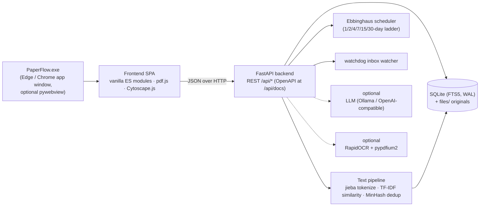

<div align="center">

# PaperFlow

**本地优先的文档管理器 —— 阅读 · 检索 · 关联 · 记忆**

[](https://github.com/luzhijintou/paperflow/releases/latest)
[](LICENSE)
[](https://github.com/luzhijintou/paperflow/releases/latest)
[](https://www.python.org/)
[](https://github.com/luzhijintou/paperflow/stargazers)

[简体中文](./README.md) | [English](./README_EN.md)

*无需安装、无需注册、无需联网 —— 文档的阅读、检索、批注、复习与知识关联，全部发生在一台笔记本电脑上。*


</div>

---

## 目录

- [1. 这是什么](#1-这是什么)
- [2. 与常见工具的定位对比](#2-与常见工具的定位对比)
- [3. 核心功能](#3-核心功能)
- [4. 快速开始](#4-快速开始)
- [5. 推荐的使用流程](#5-推荐的使用流程)
- [6. 系统架构](#6-系统架构)
- [7. 隐私与数据主权](#7-隐私与数据主权)
- [8. FAQ](#8-faq)
- [9. REST API（节选）](#9-rest-api节选)
- [10. 开发与测试](#10-开发与测试)
- [11. 已知限制](#11-已知限制)
- [12. 路线图](#12-路线图)
- [13. 参与贡献](#13-参与贡献)
- [14. 许可证](#14-许可证)

---

## 1. 这是什么

PaperFlow 是一个**本地优先（local-first）**的文档管理器：把导入的每一份 PDF / EPUB 变成可全文检索、可批注、可复习、可在知识图谱中互相关联的节点。它不追求替代 Zotero 的引文排版能力，而是回答一个更基本的问题：

> 当你把一份份文档存进文件夹之后，**读过的东西如何被找到、被记住、被再次想起？**

围绕这个问题，PaperFlow 内置了一条完整的阅读闭环：

| 能力 | 说明 |
| --- | --- |
| **管理** | PDF / EPUB 导入（拖拽、路径、文件夹监控）、封面网格视图、集合 / 标签 / 查重 |
| **检索** | SQLite FTS5 倒排索引 + jieba 中文分词，标题 / 作者 / 摘要 / 正文一并命中，毫秒级响应 |
| **阅读** | pdf.js 渲染的 PDF 阅读器与按章阅读的 EPUB 阅读器，竖向滚动 / 横向翻页 |
| **批注** | 选中即高亮（4 色）、笔记、**文档间双向链接**、一键制卡 |
| **关联** | TF-IDF 语义相似度自动推荐相关文档；Obsidian 风格力导向知识图谱 |
| **记忆** | 基于**艾宾浩斯遗忘曲线**的按天间隔重复排程（1 / 2 / 4 / 7 / 15 / 30 天阶梯） |
| **整理** | 可视化 if-then 规则引擎、SHA-256 / MinHash 智能去重、AI 摘要与打标（可选，支持全本地） |
| **带走** | 全库 JSON、单篇 Markdown、Obsidian、Anki 一键导出；完整 REST API |

所有数据（SQLite 数据库 + 原文件副本）保存在本地一个 `data/` 目录中；应用可以完全离线运行，不注册账号、无遥测、无云端依赖。

PaperFlow **不局限于学术场景**：论文、技术报告、产品手册、标准规范、教材、电子书，乃至轻小说 / 画集，只要是 PDF / EPUB，都能获得同一套检索、批注、关联与复习能力。

## 2. 与常见工具的定位对比

下表为诚实的定位对比，而非"取代声明"——PaperFlow 刻意不做引文样式排版（见[已知限制](#11-已知限制)）。

| 维度 | PaperFlow | 云端文献管理器（Zotero / EndNote 等） |
| --- | --- | --- |
| 数据位置 | 本地 `data/` 目录，复制即备份 | 本地库 + 云同步（需注册账号） |
| 离线可用 | ✅ 完全离线，无任何网络依赖 | 多数可离线，同步 / 账号需联网 |
| 中文全文检索 | ✅ jieba 分词 + FTS5，开箱即用 | 支持，中文分词质量与配置因工具而异 |
| 知识图谱 | ✅ 内置（文档–标签–链接–相似四类关系） | 通常需插件（如 Zotero Graph） |
| 间隔重复复习 | ✅ 内置艾宾浩斯按天排程 | ❌ 通常无（需外部 Anki + 插件） |
| Obsidian / Anki 导出 | ✅ 内置 | 需插件 |
| 扫描件 OCR | ✅ 可选组件，设置页一键安装 | ❌ 通常需外部工具 |
| AI 摘要 / 打标 | ✅ 可选，支持 Ollama 全本地运行 | 部分支持，多依赖云服务 |
| 账号 / 遥测 | 无 | 需要账号 |
| 引文样式 / Word 插件 | ❌ 不在范围内 | ✅ 核心能力 |
| 价格 | 免费开源（MIT） | Zotero 免费（存储收费）/ EndNote 收费 |

**一句话定位**：需要严格的引文管理与协作，用 Zotero；想要一个**只属于自己、不开账号、读过的每一段话都能被检索和复习**的私人文档工作台，试试 PaperFlow。

## 3. 核心功能

### 3.1 文档库

- **导入**：拖拽 / 文件选择 / 从路径或文件夹导入，或把 PDF 丢进受监控的收件箱文件夹（watchdog + 去抖动），新文件自动导入并建立索引；**标题跟随文件名**（临时名 / 扫描件名自动回退文档元数据标题）
- **加密 PDF**：带打开口令的 PDF 照常导入并标记「需密码」，阅读器中输入密码即可阅读；勾选「记住密码」（仅保存在本机数据库）后自动建立全文索引，OCR 同样可用（可随时在阅读器信息栏「忘记密码」）
- **封面网格 / 列表双视图**：列表显示高清封面（PDF 第一页 / EPUB 内嵌封面）、作者、年份、页数、导入时间；视图与排序偏好本地记忆
- **集合 / 标签 / 状态筛选**（含「需密码」「需 OCR」状态），按导入时间 / 标题 / 作者 / 最近阅读等排序
- **智能去重**：SHA-256 精确去重 + MinHash 近似重复 + 标题相似版本建议，收件箱内一键合并


### 3.2 中文全文检索

- SQLite **FTS5** 倒排索引，`jieba` 对中文做词典分词，中英混排文档同样可查
- 标题、作者、关键词、摘要、正文一并索引，命中片段高亮
- 纯本地索引：10,000 篇规模的库，查询中位延迟在毫秒量级，边输入边出结果

### 3.3 精读批注与阅读器

- **选中文字即操作**：高亮（4 色）、写笔记、建立到另一篇文档的**双向链接**、生成复习卡片；鼠标拖选或**右键点选**（自动选中光标处的词语，中文按词）均可，页面之外仍保留浏览器原生右键菜单
- **PDF 页内查找**：`Ctrl/Cmd+F` 命中处强高亮、当前项描边并自动滚到视野内，`‹ ›` / Enter 跳转；另有 `→ ← 空格 PgUp PgDn Home End` 翻页与 `+ - 0` 缩放快捷键
- **目录侧栏**：PDF 大纲 / EPUB 章节列表，阅读时联动高亮当前节，点击直达
- **PDF 双页（书册跨页）浏览**：竖向与横向模式均可开启，封面独占、之后左偶右奇成对，工具栏 `↑↓` 与键盘方向键按**整跨页**一致步进
- **一键全屏阅读**：全屏内「信息 / 批注 / 相似 / 链接」侧栏照常可用，浮层工具条 / 提示 / 弹窗同样可见
- **EPUB 按章阅读**：书籍自身排版经服务端消毒后在 Shadow DOM 中还原（字体 / 配色接近原生阅读器且与应用样式完全隔离）；内嵌字体与图片经安全资产端点供给；横向模式按屏幕分页翻页（整页插图自动收进一屏）
- 批注汇总视图可搜索；批注随单篇 Markdown / Obsidian 导出一并带走
- 扫描版 PDF 经本地 OCR 后，识别文本以**透明文字层**叠加在原页上，可直接选中与批注（体验与商业阅读器一致）


### 3.4 知识图谱

- 文档、标签为节点；**引用式双向链接、TF-IDF 语义相似、标签共现**为边
- Obsidian 风格力导向布局（Cytoscape.js + fcose）：节点按连接度缩放，hover 聚焦邻域，其余淡出；标签随缩放自适应显隐
- 相似度阈值滑杆（15% / 30% / 50%）实时增删边；按标题 / 标签搜索可回车定位节点；支持节点自定义染色与手动建立文档间联系
- 双击节点直接跳转阅读


### 3.5 艾宾浩斯间隔复习

- 从批注或选区一键生成卡片；卡片按**遗忘曲线**排程：固定日间隔阶梯 `1 → 2 → 4 → 7 → 15 → 30` 天
- 评分四档：**简单**跳一档、**良好**按阶梯推进、**困难**原地重复、**忘记**回到第 1 天；走完阶梯后按 ease 因子自适应延长
- 每次评分实时预览"下次复习时间"；顶部导航常驻**待复习计数**


### 3.6 自动化与可选智能

- **规则引擎**：可视化 if-then 编辑器（条件：正文 / 文件名 / 标题 / 标签 / 年份 / 类型 / 页数…；动作：打标签 / 归类 / 重命名 / 触发分析），导入时自动生效
- **AI 摘要 / 元数据 / 打标**（可选）：任何 OpenAI 兼容接口——Ollama 全本地、DeepSeek、OpenAI 均可；未配置时功能静默降级，不影响其它能力
- **本地 OCR**（可选）：设置页一键安装 pypdfium2 + RapidOCR（含中文模型）到 `data/pylibs`，无需命令行、无需重启；流式分批识别，内存占用恒定（300+ 页扫描书峰值 ~1 GB）；支持一键切换 **DirectML GPU 加速**（NVIDIA / AMD / Intel 的 DX12 显卡，无需 CUDA），失败自动回滚 CPU
- **文件夹监控**：watchdog 监听 + 去抖动，新文件落入即导入、提取文本、套用规则

### 3.7 开放数据

- **全库导出** JSON；**单篇导出** Markdown（含 frontmatter / 摘要 / 批注 / 双向链接）
- **导出 Obsidian**：笔记间 `[[wikilink]]` 互联，直接落入你的 vault；标题同名但内容不同的文档自动追加 `_2` / `_3` 后缀，绝不互相覆盖（每篇 frontmatter 带 `paperflow_id` 身份标记，重复导出幂等更新）
- **导出 Anki**：经 AnkiConnect 推送；笔记类型与正 / 背面字段可在设置中配置，推送前校验字段是否存在，「重复跳过」与「真实失败」分别计数并明确提示
- **完整 REST API**：自带 OpenAPI 文档（`/api/docs`），支持可选 API Key 鉴权与事件 Webhook（详见 [§9](#9-rest-api节选)）

## 4. 快速开始

### 4.1 Windows 安装包（推荐）

1. 前往 [**Releases**](https://github.com/luzhijintou/paperflow/releases/latest) 下载 `PaperFlow-win64-*.zip`（当前版本 **v0.8.0**，更新见 [CHANGELOG](CHANGELOG.md)）
2. 解压到任意位置（如 `D:\PaperFlow`）
3. 双击 `PaperFlow.exe`

> 首次运行如出现 SmartScreen 提示：点「更多信息 → 仍要运行」。应用未做代码签名（见[已知限制](#11-已知限制)）。

- **系统要求**：Windows 10 / 11（64 位）。默认桌面窗口使用系统自带的 Microsoft Edge（app 模式），无需额外依赖
- **卸载**：删除文件夹即可，不留注册表残留
- **备份**：复制 `data/` 目录即完成全部备份

### 4.2 从源码运行

```bash
git clone https://github.com/luzhijintou/paperflow.git
cd paperflow
pip install -r requirements.txt

# Web 模式（浏览器访问 http://127.0.0.1:8300）
python run.py

# 或桌面窗口模式（自动探测 pywebview，缺省回退 Edge/Chrome app 窗口）
python run_desktop.py
```

仓库内 `deps/` 目录已打包全部运行依赖（解包后的 wheel），`backend/paths.py` 会自动将其注入 `sys.path`——在一台**没有网络、无法 pip install** 的机器上同样可以源码运行（需要 Python 3.11+，已在 3.13 验证）。可选依赖见 `requirements-desktop.txt`（嵌入式窗口）与 `requirements-ocr.txt`（OCR）。

**命令行参数**：

```bash
python run.py --port 9000        # 换端口
python run.py --host 0.0.0.0     # 局域网访问（建议同时在设置里配置 API Key）
python run.py --reload           # 开发热重载
```

### 4.3 桌面窗口与自行打包

除浏览器访问外，PaperFlow 也能作为**原生桌面窗口**运行——一个干净的无边框应用窗口，后端 FastAPI 在后台线程内启动，窗口只加载 `http://127.0.0.1:<port>`：

```bash
python run_desktop.py --port 8300     # 指定端口（被占用会自动向上找空闲端口）
python run_desktop.py --browser edge  # 强制 Edge/Chrome app 模式（auto|pywebview|edge）
python run_desktop.py --url-only      # 只起后端、不开窗口（打印 URL，适合脚本/服务）
```

- Windows 下也可双击仓库根目录的 **`PaperFlow.bat`**（带控制台，便于看日志）或 **`PaperFlow.vbs`**（静默启动）快速开始
- 单实例友好：若检测到目标端口已有 PaperFlow 在跑，会直接复用、不再重复起服务
- 想要**真正内嵌的原生窗口**（WebView2 / WebKit）而非浏览器 app 模式：`pip install -r requirements-desktop.txt`（安装 `pywebview`）后启动时自动检测并优先使用，检测不到则透明回退

**打包成独立 `.exe`（无需 Python，可分发）**：

```bash
pip install pyinstaller          # 或 python tools/install_extra.py pyinstaller
python build_exe.py              # 产物在 dist/PaperFlow/
```

- 运行 **`dist/PaperFlow/PaperFlow.exe`** 即打开桌面客户端；分发时请**整个 `dist/PaperFlow/` 文件夹**一起拷贝（onedir 模式，已内置 Python 运行时 + 全部依赖 + 前端 + jieba 词典）
- `build_exe.py --onefile` 可打成单个 exe（启动稍慢）；`--console` 保留控制台便于排错

### 4.4 数据目录与备份

| 运行方式 | 数据库位置 | 说明 |
| --- | --- | --- |
| `run.py` / `run_desktop.py`（源码） | `paperflow/data/` | 两者**共享同一库**，桌面窗口能看到 Web 端导入的文档 |
| `PaperFlow.exe`（打包版，默认） | `dist/PaperFlow/data/`（便携） | 独立空库；不可写时回退 `%APPDATA%/PaperFlow/data` |

界面缓存（内嵌窗口的 WebView2 配置目录、启动页）不在 `data/` 里，而在 `%LOCALAPPDATA%\PaperFlow\`——备份 `data/` 时不含浏览器缓存垃圾，也不会出现「程序在文档库目录里大量写文件」这种容易被杀软误判的行为。

想让打包版 exe 直接使用你现有的库，设置环境变量指向已有 data 目录即可：

```bash
# Windows PowerShell
$env:PAPERFLOW_DATA="D:\path\to\paperflow\data"; .\dist\PaperFlow\PaperFlow.exe
```

## 5. 推荐的使用流程

一套被反复验证过的闭环，对应上一节的四个截图：

1. **导入与整理** —— 把新到的 PDF 拖进收件箱文件夹；规则引擎自动打标签、归类；重复文档在收件箱里一键合并
2. **精读与批注** —— 在阅读器里高亮关键论断、写下笔记；读到方法相近的旧文时，选中文字建立双向链接
3. **制卡与复习** —— 每读完一篇，把 2–3 个核心结论制成卡片；每天打开"复习"按艾宾浩斯排程过一遍当天到期的卡片
4. **关联与发现** —— 需要回顾某个主题时打开知识图谱，按相似度找回"读过但想不起来"的文档；双击节点回到原文
5. **沉淀与带走** —— 阶段性导出 Markdown / Obsidian，把批注和双向链接并入自己的长期笔记体系

## 6. 系统架构



| 层 | 技术 | 说明 |
| --- | --- | --- |
| 桌面壳 | Edge/Chrome `--app` 模式（默认）；pywebview（可选） | 零依赖打开无边框窗口，可选嵌入式 WebView2 |
| 前端 | 原生 ES Modules，**无构建步骤** | pdf.js（PDF 渲染）、Cytoscape.js + fcose（图谱） |
| 后端 | Python 3.13 · FastAPI · Uvicorn | 全部能力经 REST API 暴露，自带 OpenAPI 文档 |
| 存储 | SQLite（FTS5 + WAL）+ 原文件副本 | 单文件数据库，复制 `data/` 即完整备份 |
| 文本处理 | jieba 分词 · TF-IDF 余弦相似度 · MinHash 近似去重 · SHA-256 精确去重 | 全部本地计算 |
| 打包 | PyInstaller（onedir） | 依赖随 exe 分发，无需安装 Python |

**项目结构**：

```
paperflow/
├── run.py                     # Web 入口：注入 deps、启动 uvicorn（浏览器访问）
├── run_desktop.py             # 桌面入口：后台起 FastAPI + 原生窗口（Edge app / pywebview）
├── build_exe.py               # 打包独立 PaperFlow.exe（PyInstaller CLI，版本无关）
├── PaperFlow.bat / .vbs       # Windows 启动器（带控制台 / 静默）
├── requirements.txt           # 常规 pip 依赖（deps/ 为等价的打包副本）
├── requirements-desktop.txt   # 可选：pywebview（内嵌原生窗口，缺省回退 Edge/Chrome）
├── backend/
│   ├── paths.py               # sys.path 注入 + 目录常量（含冻结模式 / PAPERFLOW_DATA）
│   ├── db.py                  # SQLite schema / 连接 / settings / events
│   ├── textproc.py            # PDF 文本提取（含加密 PDF）、jieba 分词、MinHash 签名
│   ├── search.py              # FTS5 索引与检索
│   ├── similarity.py          # TF-IDF 向量、余弦、近似去重、版本识别
│   ├── ai.py                  # OpenAI 兼容分析（摘要 / 元数据 / 标签）
│   ├── ingest.py              # 导入管道（哈希 / 副本 / 文本 / 索引 / 入队）
│   ├── rules.py               # 规则引擎（条件求值 + 动作执行）
│   ├── watcher.py             # 文件夹监控（watchdog + 去抖动）
│   ├── tasks.py               # 后台任务队列（worker 线程 + webhook 推送）
│   ├── review.py              # 艾宾浩斯间隔重复 + 阅读进度
│   ├── exports.py             # JSON / Markdown / Obsidian / Anki 导出
│   └── api.py                 # FastAPI 路由 + 静态前端挂载
├── frontend/                  # 原生 ES Module，无构建
│   ├── index.html · style.css # 极简设计系统（明 / 暗主题）
│   ├── vendor/                # pdf.js + cytoscape + fcose（本地化，含 CJK cmaps 与标准字体）
│   └── js/                    # i18n / icons / api / util / app + views/{library,reader,graph,review,inbox,settings}
├── tools/                     # 安装 / 样例 / 测试 / 校验脚本
└── data/                      # 运行期：paperflow.db、files/ 副本、samples/
```

**关键设计**：

- 单 worker 线程消费持久化 `jobs` 表，重活（AI / OCR / 去重 / webhook）不阻塞请求；崩溃后重启自动重排队
- 导入即算 SHA-256 精确去重；文本进 FTS5（jieba 预分词，中文可搜）+ TF-IDF 稀疏向量 + MinHash 签名
- 批注采用「页码 + 归一化矩形 + 文本引用」锚点，PDF 不重排故锚点稳定，缩放自适应
- 加密 PDF 三重保障：导入先试空密码（兼容仅设权限标志的出版方 PDF）→ 阅读器密码框交给 pdf.js 解密 → 密码校验通过后回填后端建立索引，密码仅存本机数据库
- 页面跨层定位一律用 `getBoundingClientRect()` 换算文档坐标：pdf.js 页面元素的 `offsetParent` 是视图容器，`offsetTop` 会额外带上工具栏高度，混用两套坐标会导致翻页 / 滚动定位偏差
- 全屏时**仅全屏元素的子树参与渲染**——弹窗 / 提示 / 选区工具条等浮层根节点会随 `fullscreenchange` 重新挂载到 `document.fullscreenElement`，否则在全屏阅读中完全不可见

## 7. 隐私与数据主权

- **无账号、无遥测、无强制联网**：核心功能在拔掉网线后完整可用
- **数据可携**：`data/` 目录 = SQLite 数据库 + 原始文件，随时整目录拷走；导出格式为开放的 JSON / Markdown
- **AI 完全可选**：接入 Ollama 即可全本地推理，文档内容不出机器；不配置则无任何 AI 调用
- **API 安全**：可选 API Key 鉴权；默认仅监听本机回环地址
- **库目录保持干净**：内嵌窗口（WebView2）的缓存与配置位于 `%LOCALAPPDATA%\PaperFlow\`，不写入 `data/`；`data/` 中只有数据库、文件副本与日志

## 8. FAQ

**数据存在哪里？会丢吗？**
全部在程序目录（或便携位置）的 `data/` 下：一个 SQLite 库 + `files/` 里的文件副本。备份 = 复制这个目录；卸载 = 删除文件夹。

**是绿色便携软件吗？**
是。 exe 可放在 U 盘 / 移动硬盘上运行；目录可写时数据跟随 exe 所在目录。

**首次运行被 SmartScreen 拦截？**
应用未购买代码签名证书。点「更多信息 → 仍要运行」即可；介意的话可从源码运行（见 4.2）。

**必须配置 AI 吗？**
不必须。AI 摘要 / 打标是可选增强；不配置时相应按钮降级，检索、批注、图谱、复习完全不受影响。需要 AI 时接 Ollama 即可全本地运行。若 AI 分析没有反应：先在「设置 → AI 模型」启用并点「测试连接」，分析在后台队列执行，进度见「收件箱」。

**扫描版 PDF 怎么办？**
设置页 → OCR → 一键安装（自动下载本地识别组件到 `data/pylibs`，支持失败后切换境内镜像）。识别完成后扫描页出现可选中文字层，正文进入搜索与图谱。旧版本识别过的文档需重新识别一次才会出现文字层。

**加密 PDF 怎么读？**
导入不受影响——文件照常入库并标记「需密码」。在阅读器中打开时输入打开口令即可阅读；勾选「记住密码」（仅保存在本机数据库）后，后续打开与检索 / OCR 均自动解锁。阅读器信息栏可随时「忘记密码」。

**支持多设备同步吗？**
没有内置云同步（这是刻意的设计）。可以用网盘同步 `data/` 目录，但请注意：SQLite 在多端同时写入可能产生锁冲突，建议同一时刻只在一端使用。

**为什么桌面窗口是 Edge？**
默认用系统自带 Edge/Chrome 的 `--app` 模式打开无边框窗口，零额外依赖；如偏好真正的嵌入式窗口，`pip install pywebview` 后自动切换（WebView2）。

## 9. REST API（节选）

自带交互式文档：启动后访问 **`/api/docs`**。

| 方法 | 路径 | 说明 |
| --- | --- | --- |
| GET | `/api/documents` | 列表（q / tag / collection / status / sort…） |
| POST | `/api/documents/import` | 上传导入（multipart） |
| POST | `/api/documents/import-path` | 按服务器路径 / 文件夹导入 |
| GET | `/api/documents/{id}/file` | 取原文件 |
| POST | `/api/documents/{id}/analyze` | 触发 AI 分析 |
| POST | `/api/documents/{id}/unlock` | 提交加密 PDF 密码（可选记住） |
| DELETE | `/api/documents/{id}/password` | 忘记已保存的密码 |
| GET | `/api/search?q=` | 全文检索 |
| GET | `/api/documents/{id}/similar` | 相似推荐 |
| POST | `/api/documents/{id}/annotations` | 建批注 |
| POST | `/api/documents/{id}/links` | 建双向链接 |
| GET | `/api/graph` | 图谱数据 |
| GET | `/api/review/due` · POST `/api/review/{cid}/rate` | 复习 |
| GET/POST | `/api/rules` · `/api/rules/apply` | 规则引擎 |
| POST | `/api/suggestions/scan` · `/api/suggestions/{id}/resolve` | 去重 / 版本 |
| GET | `/api/export/json` · POST `/api/export/obsidian` · `/anki` | 导出 |
| GET/PUT | `/api/settings` | 配置 |

**Webhook 事件**：`document.imported` / `document.analyzed` / `document.duplicate` / `rule.applied` / `link.created` / `annotation.created` / `job.failed` 等，POST JSON 到设置里配置的 URL。

**鉴权**：设置 API Key 后，外部调用需带 `X-API-Key` 头（本机 Web UI 同源免鉴权）。

## 10. 开发与测试

```bash
python run.py &                   # 先启动服务（默认 8300）
# 若打包版 PaperFlow.exe 正占用 8300（它读写 dist/PaperFlow/data 的生产库），
# 把写操作的测试指向另一台源码服务器，避免误伤真实数据：
#   python run.py --port 8399 &
#   PF_TEST_BASE=http://127.0.0.1:8399 python tools/test_backend.py

python tools/test_backend.py      # 后端端到端 107 项：导入 / 去重 / 搜索 / 相似 / 批注 / 链接 / 图谱 / 标签 / 艾宾浩斯 / 进度 / 规则 / 导出 / 加密 PDF 全流程（自带清理，可在真实库上安全运行）
python tools/test_epub.py         # EPUB 管线 55 项：导入 / 元数据 / 搜索 / 目录 / 章节消毒(XSS) / CSS 作用域 / 整页 SVG 包图 / ruby / 资产穿越拒绝 / 封面 / 进度
python tools/test_title.py        # 导入标题一致性：文件名优先 / 临时名回退元数据
python tools/test_background.py   # 自定义背景图 API：上传 / 类型校验 / 透明度合并 / 删除清理
python tools/test_ocr.py          # OCR 自适应：一键安装端点 / 扫描件 needs_ocr；未装引擎降级提示，已装则真实 OCR 端到端
python tools/smoke_readonly.py    # 只读端点冒烟（含中文搜索），不改动数据
python tools/check_imports.py     # 前端模块导入图自洽
node --check frontend/js/**/*.js  # 前端语法

# 桌面客户端（不需先起服务）
python tools/test_desktop_logic.py  # 端口解析 / 单实例 / 浏览器探测等纯逻辑
python build_exe.py                 # 打包 dist/PaperFlow/PaperFlow.exe
python tools/test_frozen_exe.py     # 冻结 exe：起服务 + 提供前端 / 静态资源
```

当前状态：后端端到端 **107/107**（含加密 PDF 全流程 13 项）、EPUB 管线 **55/55**、标题一致性 5/5、背景图 API 21/21 通过；前端各视图经无头浏览器 DOM 校验正常渲染，阅读器交互（工具栏单行布局、上下翻页定位（竖向 / 横向 × 单页 / 双页四条路径逐一验证）、页内查找高亮与居中、右键选中浮出工具条、全屏下的浮层挂载）通过校验。

仓库附带演示库生成脚本（`tools/make_samples.py` → `make_multipage.py` → `make_chinese_sample.py` → `seed_demo.py`），一条链生成中英混合样例并导入，方便开发时快速看到各功能生效。

## 11. 已知限制

诚实地列出，供评估是否适合你：

- **仅提供 Windows x64 打包**。源码本身可跨平台运行（Python），但 macOS / Linux 需自行处理
- **未做代码签名**：SmartScreen 会提示，需要手动放行
- **单机应用**：无内置云同步、无多人协作；多端经网盘同步 `data/` 有 SQLite 锁风险
- **不做引文管理**：BibTeX 导入、引文样式排版、Word 引用插件不在范围内——这些请交给 Zotero / EndNote，PaperFlow 定位于阅读与知识内化环节
- **万级以上文档库未经充分压测**：千级规模经过日常验证；更大规模欢迎反馈
- **版本迭代较快（当前 v0.8.0）**：数据格式可能随版本演进，升级前请备份 `data/` 目录
- **可能被杀软启发式误报**：程序未做代码签名，且内嵌浏览器组件启动时会写入缓存文件。缓存已移出文档库目录（改到 `%LOCALAPPDATA%\PaperFlow\`）并将磁盘缓存上限压到 1 MB；若仍被拦截（如 360「勒索防护」误报），请选择放行并欢迎反馈
- **AES 加密 PDF 的文本提取待补全**：带 AES 加密（AESV2 / V5）的 PDF 可在阅读器中正常输入密码阅读，但服务端抽文本 / OCR 需要额外的加密依赖，当前提示不支持（有网络后即可补装）

## 12. 路线图

**已实现但需可选依赖激活**

- **OCR 扫描件识别**：完整代码路径已接好（见 3.6）。在「设置 → OCR」点**一键安装**（pypdfium2 + rapidocr + onnxruntime，全离线含中文）并启用即可对扫描件提取文字。收件箱对待识别扫描件提供**「全部加入 OCR 队列」**批量按钮，后台单线程队列逐篇处理；OCR 结果为空的扫描件自动回到「需 OCR」状态
- **OCR GPU 加速（DirectML）**：「设置 → OCR」一键切换 GPU 运行时（NVIDIA / AMD / Intel 的 DX12 显卡均可，无需安装 CUDA），失败自动回滚 CPU；引擎实例跨任务复用。实测 6 页样张 GPU 约 0.3–0.5s/页 vs CPU 约 0.7–0.8s/页

**P3+ 规划（尚未包含）**

- **引用关系图谱**（面向学术 PDF）：集成 GROBID 解析参考文献 + Crossref / OpenAlex 消歧
- **自动生成目录**：字号启发式（原生 PDF）→ 版面模型（扫描件）+ 人工确认
- **多文档对比**：并排页级同步 + 文本 / 像素差异
- **协作分享**：只读分享链接优先；多用户权限 / 评论线程建议作为独立 Server 模式插件
- **静态加密**：SQLCipher 元数据库 + 文件级加密（"本地优先"下比字面 E2EE 更实际）

## 13. 参与贡献

Issue 与 PR 均欢迎。本地开发：

```bash
pip install -r requirements.txt -r requirements-dev.txt
python run.py                   # 启动开发服务器
python tools/test_backend.py    # 后端端到端测试
```

遇到问题或有建议，也欢迎发邮件至 **cathesaa@foxmail.com**（附复现步骤与截图更便于定位）。

## 14. 许可证

[MIT](LICENSE) © 2026 PaperFlow contributors

第三方组件：pdf.js（Apache-2.0）、cytoscape.js（MIT）、jieba（MIT）、pypdf（BSD）、FastAPI（MIT）等，见 `deps/VERSIONS.txt`。

---

<div align="center">
<sub>如果 PaperFlow 对你的研究有帮助，欢迎点一个 Star ⭐</sub>
</div>
