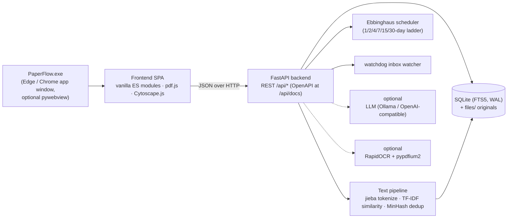

<div align="center">

# PaperFlow

**A local-first literature manager — read · search · connect · remember**

[](https://github.com/luzhijintou/paperflow/releases/latest)
[](LICENSE)
[](https://github.com/luzhijintou/paperflow/releases/latest)
[](https://www.python.org/)
[](https://github.com/luzhijintou/paperflow/stargazers)

[简体中文](./README.md) | [English](./README_EN.md)

*No installer, no account, no internet required — reading, full-text search, annotation, spaced review, and knowledge linking all happen on one laptop.*


</div>

---

## Table of Contents

- [1. What is PaperFlow?](#1-what-is-paperflow)
- [2. Positioning vs. Cloud Reference Managers](#2-positioning-vs-cloud-reference-managers)
- [3. Core Features](#3-core-features)
- [4. Getting Started](#4-getting-started)
- [5. A Recommended Research Workflow](#5-a-recommended-research-workflow)
- [6. Architecture](#6-architecture)
- [7. Privacy & Data Sovereignty](#7-privacy--data-sovereignty)
- [8. FAQ](#8-faq)
- [9. REST API (Selected)](#9-rest-api-selected)
- [10. Development & Testing](#10-development--testing)
- [11. Known Limitations](#11-known-limitations)
- [12. Roadmap](#12-roadmap)
- [13. Contributing](#13-contributing)
- [14. License](#14-license)

---

## 1. What is PaperFlow?

PaperFlow is a **local-first** literature manager: every imported PDF / EPUB becomes a node that is full-text searchable, annotatable, reviewable, and connected in a knowledge graph. It does not try to replace Zotero's citation-formatting pipeline; instead it answers a more basic question:

> Once a paper is saved into a folder, **how do the things you read get found, remembered, and recalled?**

To that end, PaperFlow ships a complete reading loop:

| Capability | Description |
| --- | --- |
| **Manage** | PDF / EPUB import (drag & drop, path, watched inbox folder), cover grid view, collections / tags / deduplication |
| **Search** | SQLite FTS5 inverted index with `jieba` Chinese segmentation; titles, authors, abstracts, and body text in one index; millisecond queries |
| **Read** | A pdf.js-powered PDF reader and a chapter-based EPUB reader; vertical scroll or paged mode |
| **Annotate** | Select-to-highlight (4 colors), notes, **bidirectional links between documents**, one-click flashcards |
| **Connect** | TF-IDF semantic similarity recommends related papers; Obsidian-style force-directed knowledge graph |
| **Remember** | Day-based spaced-repetition scheduling on the **Ebbinghaus forgetting curve** (1 / 2 / 4 / 7 / 15 / 30-day ladder) |
| **Organize** | Visual if-then rule engine, SHA-256 / MinHash smart deduplication, optional AI summaries and tagging (fully local capable) |
| **Export** | Whole-library JSON, per-paper Markdown, Obsidian, and Anki one-click export; full REST API |

All data (SQLite database + original file copies) lives in a single local `data/` folder. The app runs fully offline — no account, no telemetry, no cloud dependency. The UI is available in **Chinese and English** (Settings → Language).

## 2. Positioning vs. Cloud Reference Managers

An honest comparison — not a claim to replace anything. PaperFlow deliberately stays out of citation formatting (see [Known Limitations](#11-known-limitations)).

| Dimension | PaperFlow | Cloud managers (Zotero / EndNote etc.) |
| --- | --- | --- |
| Data location | Local `data/` folder; copying it *is* the backup | Local library + cloud sync (account required) |
| Offline use | ✅ Fully offline, zero network dependency | Mostly offline-capable; sync/account needs network |
| Chinese full-text search | ✅ jieba segmentation + FTS5, works out of the box | Supported, but segmentation quality varies by tool |
| Knowledge graph | ✅ Built in (doc–tag–link–similarity edges) | Usually plugin-based (e.g. Zotero Graph) |
| Spaced repetition | ✅ Built-in Ebbinghaus day-based scheduler | ❌ Usually none (external Anki + plugins) |
| Obsidian / Anki export | ✅ Built in | Plugin-based |
| OCR for scanned PDFs | ✅ Optional component, one-click install in Settings | ❌ Usually external tools |
| AI summary / tagging | ✅ Optional; supports fully local Ollama | Partial; mostly cloud services |
| Account / telemetry | None | Account required |
| Citation styles / Word plugin | ❌ Out of scope | ✅ Core capability |
| Price | Free, open source (MIT) | Zotero free (storage paid) / EndNote paid |

**In one sentence**: for strict citation management and collaboration, use Zotero; for a private reading workbench that **belongs only to you, requires no account, and makes everything you read searchable and reviewable**, try PaperFlow.

## 3. Core Features

### 3.1 Library

- **Import** by drag & drop / file picker / path or folder, or drop PDFs into a watched inbox folder (watchdog + debounce) — new files are imported and indexed automatically; **titles follow filenames** (temp / scan-style names fall back to document metadata)
- **Password-protected PDFs** import as “needs password” and open with a password prompt; ticking “remember password” (stored only in your local database) builds the full-text index automatically, and OCR works too (forget it any time from the reader's info panel)
- **Grid / list views** with high-resolution covers (PDF first page / EPUB embedded cover), authors, year, page count, import time; view and sort preferences are remembered locally
- **Collections / tags / status filters** (including “Needs password” and “Needs OCR”), sortable by import time / title / author / recently read
- **Smart deduplication**: exact SHA-256, near-duplicate MinHash, and title-similarity version suggestions with one-click merge in the inbox


### 3.2 Chinese full-text search

- SQLite **FTS5** inverted index; `jieba` performs dictionary-based Chinese segmentation; mixed Chinese–English documents are fully searchable
- Titles, authors, keywords, abstracts, and body text indexed with highlighted snippets
- Fully local: at the 10,000-document scale, median query latency stays in the millisecond range

### 3.3 Close reading & annotation

- **Select text to act**: highlight (4 colors), note, create a **bidirectional link** to another paper, or generate a review card; drag-select or **right-click a word** (word-aware for Chinese) — native browser menus are kept outside the page
- **In-document find (PDF)**: `Ctrl/Cmd+F` paints solid, readable highlights, outlines the current match and scrolls it into view; `‹ ›` / Enter step through matches; `→ ← Space PgUp PgDn Home End` page-turn and `+ - 0` zoom shortcuts included
- **TOC sidebar**: PDF outline / EPUB chapter list with active-entry tracking while you read; click to jump
- **PDF two-up (book-spread) browsing**: available in both vertical and horizontal modes — the cover stands alone, then pages pair up even-left / odd-right; the `↑↓` buttons and arrow keys step by **whole spreads**
- **One-click fullscreen reading**: the Info / Notes / Similar / Links sidebar and floating layers (toolbars, toasts, modals) all remain available in fullscreen
- **Chapter-based EPUB reading**: the book's own typography is sanitized server-side and applied inside a Shadow DOM (fonts / colors close to a native reader, fully isolated from the app); embedded fonts and images are served through a safe asset endpoint; horizontal mode paginates a chapter by screen height (full-page images fit one screen)
- A searchable annotation summary view; annotations travel with Markdown / Obsidian export
- Scanned PDFs get a **transparent selectable text layer** aligned to the original page after local OCR — select, copy, and annotate just like with commercial readers


### 3.4 Knowledge graph

- Nodes: documents and tags; edges: **bidirectional links, TF-IDF similarity, and tag co-occurrence**
- Obsidian-style force-directed layout (Cytoscape.js + fcose): nodes scale with degree, hovering focuses the neighborhood and fades the rest, labels adapt to zoom
- Similarity threshold slider (15% / 30% / 50%) adds and removes edges live; search by title / tag and press Enter to focus a node; custom node colors and manually created document links
- Double-click a node to jump straight into reading


### 3.5 Ebbinghaus spaced review

- Turn any highlight or selection into a flashcard; cards are scheduled on the forgetting curve: a fixed day ladder `1 → 2 → 4 → 7 → 15 → 30`
- Four grades: **Easy** skips ahead, **Good** advances the ladder, **Hard** repeats the same day, **Forgot** returns to day 1; after the ladder, intervals grow adaptively by an ease factor
- Every grade previews the next review date; a persistent **due counter** lives in the navigation rail


### 3.6 Automation & optional intelligence

- **Rule engine**: a visual if-then editor (conditions: body text / filename / title / tags / year / type / page count…; actions: tag / collect / rename / trigger analysis) applied on import
- **AI summary / metadata / tagging** (optional): any OpenAI-compatible endpoint — Ollama for fully local inference, DeepSeek, OpenAI; without configuration the feature degrades silently
- **Local OCR** (optional): one-click install of pypdfium2 + RapidOCR (Chinese models included) into `data/pylibs` from the Settings page — no command line, no restart; streaming page-by-page recognition keeps memory flat (~1 GB peak on 300+ page scans); one-click **DirectML GPU acceleration** switch (NVIDIA / AMD / Intel DX12 GPUs, no CUDA) with automatic fallback to CPU
- **Folder watching**: watchdog + debounce — files dropped into a watched folder are imported, text-extracted, and rule-processed automatically

### 3.7 Open data

- **Whole-library JSON export**; **per-paper Markdown export** (frontmatter / summary / annotations / backlinks)
- **Obsidian export**: notes interlinked with `[[wikilinks]]`, dropped straight into your vault; documents whose titles normalize to the same name get `_2` / `_3` suffixes instead of overwriting each other (each note carries a `paperflow_id` marker, so re-exporting updates its own note in place)
- **Anki export**: pushed via AnkiConnect; the note type and front / back fields are configurable in Settings, fields are verified before pushing, and “duplicates skipped” vs. “real failures” are counted and reported separately
- **Full REST API**: OpenAPI docs at `/api/docs`, optional API key, event webhooks (see [§9](#9-rest-api-selected))

## 4. Getting Started

### 4.1 Windows build (recommended)

1. Download `PaperFlow-win64-*.zip` from [**Releases**](https://github.com/luzhijintou/paperflow/releases/latest) (current version **v0.8.0** — see the [CHANGELOG](CHANGELOG.md))
2. Extract anywhere (e.g. `D:\PaperFlow`)
3. Double-click `PaperFlow.exe`

> If SmartScreen appears on first launch: click "More info → Run anyway". The binary is not code-signed (see [Known Limitations](#11-known-limitations)).

- **Requirements**: Windows 10 / 11 (64-bit). The default desktop window uses the system's Microsoft Edge in app mode — no extra dependencies
- **Uninstall**: delete the folder; no registry leftovers
- **Backup**: copying `data/` backs up everything

### 4.2 Running from source

```bash
git clone https://github.com/luzhijintou/paperflow.git
cd paperflow
pip install -r requirements.txt

# Web mode (open http://127.0.0.1:8300 in a browser)
python run.py

# Or desktop-window mode (auto-detects pywebview, falls back to an Edge/Chrome app window)
python run_desktop.py
```

The repo bundles all runtime dependencies as unpacked wheels under `deps/`, and `backend/paths.py` injects that folder into `sys.path` automatically — so it even runs on machines **without network access or pip** (Python 3.11+ required, validated on 3.13). Optional dependencies: `requirements-desktop.txt` (embedded window) and `requirements-ocr.txt` (OCR).

**Command-line flags**:

```bash
python run.py --port 9000        # change the port
python run.py --host 0.0.0.0     # LAN access (set an API key in Settings as well)
python run.py --reload           # dev hot-reload
```

### 4.3 Desktop window & building your own exe

Beyond the browser, PaperFlow runs as a **native desktop window** — a clean chromeless app window; the FastAPI backend boots on a background thread and the window simply loads `http://127.0.0.1:<port>`:

```bash
python run_desktop.py --port 8300     # pick a port (falls back to the next free one if taken)
python run_desktop.py --browser edge  # force Edge/Chrome app mode (auto|pywebview|edge)
python run_desktop.py --url-only      # backend only, print the URL (for scripts/services)
```

- On Windows you can also double-click **`PaperFlow.bat`** (console attached, handy for logs) or **`PaperFlow.vbs`** (silent launch) in the repo root
- Single-instance friendly: if a PaperFlow is already serving the target port, it is reused instead of starting a second server
- For a **true embedded window** (WebView2 / WebKit) instead of browser app mode: `pip install -r requirements-desktop.txt` (installs `pywebview`); startup detects it and prefers it, otherwise falls back transparently

**Building a standalone `.exe` (no Python needed to run, redistributable)**:

```bash
pip install pyinstaller          # or: python tools/install_extra.py pyinstaller
python build_exe.py              # output under dist/PaperFlow/
```

- Run **`dist/PaperFlow/PaperFlow.exe`** to open the desktop client; for distribution, copy the **whole `dist/PaperFlow/` folder** (onedir build — Python runtime, all dependencies, the frontend, and jieba dictionaries are bundled)
- `build_exe.py --onefile` produces a single exe (slower startup); `--console` keeps a console for troubleshooting

### 4.4 Data folder & backup

| How you run it | Database location | Notes |
| --- | --- | --- |
| `run.py` / `run_desktop.py` (source) | `paperflow/data/` | Both **share the same library** — the desktop window sees documents imported in the web UI |
| `PaperFlow.exe` (packaged, default) | `dist/PaperFlow/data/` (portable) | A separate empty library; falls back to `%APPDATA%/PaperFlow/data` if not writable |

UI caches (the embedded window's WebView2 profile and loading page) do **not** live in `data/` — they are kept under `%LOCALAPPDATA%\PaperFlow\`, so backing up `data/` never picks up browser-cache churn (and the app avoids the “writing thousands of files into the library folder” pattern that AV heuristics dislike).

To point the packaged exe at an existing library, set the environment variable:

```bash
# Windows PowerShell
$env:PAPERFLOW_DATA="D:\path\to\paperflow\data"; .\dist\PaperFlow\PaperFlow.exe
```

## 5. A Recommended Research Workflow

A loop that has been validated in daily use — matching the four screenshots above:

1. **Import & organize** — drop new PDFs into the inbox folder; the rule engine tags and sorts them; duplicates merge in one click
2. **Read & annotate** — highlight key claims, write notes, and create bidirectional links to older papers on the same method
3. **Make cards & review** — turn 2–3 core conclusions into flashcards per paper; clear the daily due queue with the Ebbinghaus scheduler
4. **Connect & rediscover** — when writing a review, open the graph and surface papers you read but forgot; double-click to jump back to the text
5. **Consolidate & export** — periodically export Markdown / Obsidian and merge annotations and backlinks into your long-term note system

## 6. Architecture



| Layer | Technology | Notes |
| --- | --- | --- |
| Desktop shell | Edge/Chrome `--app` mode (default); pywebview (optional) | Chromeless window with zero dependencies; embedded WebView2 optional |
| Frontend | Vanilla ES Modules, **no build step** | pdf.js (PDF rendering), Cytoscape.js + fcose (graph) |
| Backend | Python 3.13 · FastAPI · Uvicorn | Every capability exposed via REST with OpenAPI docs |
| Storage | SQLite (FTS5 + WAL) + original file copies | Single-file database; copying `data/` is a full backup |
| Text processing | jieba segmentation · TF-IDF cosine similarity · MinHash near-dup · SHA-256 exact dup | All computed locally |
| Packaging | PyInstaller (onedir) | Dependencies ship with the exe; no Python install needed |

**Project layout**:

```
paperflow/
├── run.py                     # web entry: injects deps/, starts uvicorn
├── run_desktop.py             # desktop entry: FastAPI on a thread + native window
├── build_exe.py               # PyInstaller build (version-agnostic CLI wrapper)
├── PaperFlow.bat / .vbs       # Windows launchers (console / silent)
├── requirements.txt           # regular pip deps (deps/ is the bundled copy)
├── requirements-desktop.txt   # optional: pywebview (falls back to Edge/Chrome)
├── backend/
│   ├── paths.py               # sys.path injection + dir constants (frozen mode / PAPERFLOW_DATA)
│   ├── db.py                  # SQLite schema / connections / settings / events
│   ├── textproc.py            # PDF text extraction (incl. encrypted PDFs), jieba, MinHash
│   ├── search.py              # FTS5 index & retrieval
│   ├── similarity.py          # TF-IDF vectors, cosine, near-dup, version detection
│   ├── ai.py                  # OpenAI-compatible analysis (summary / metadata / tags)
│   ├── ingest.py              # import pipeline (hash / copy / text / index / enqueue)
│   ├── rules.py               # rule engine (condition eval + actions)
│   ├── watcher.py             # folder watching (watchdog + debounce)
│   ├── tasks.py               # background job queue (worker thread + webhooks)
│   ├── review.py              # Ebbinghaus scheduler + reading progress
│   ├── exports.py             # JSON / Markdown / Obsidian / Anki export
│   └── api.py                 # FastAPI routes + static frontend mount
├── frontend/                  # vanilla ES modules, no build
│   ├── index.html · style.css # minimal design system (light / dark)
│   ├── vendor/                # pdf.js + cytoscape + fcose (local, incl. CJK cmaps)
│   └── js/                    # i18n / icons / api / util / app + views/{library,reader,graph,review,inbox,settings}
├── tools/                     # install / samples / tests / checks
└── data/                      # runtime: paperflow.db, files/ copies, samples/
```

**Key design notes**:

- A single worker thread consumes a persistent `jobs` table so heavy work (AI / OCR / dedup / webhooks) never blocks requests; jobs are re-queued after a crash
- Import computes SHA-256 for exact dedup; text feeds FTS5 (pre-tokenized by jieba → Chinese search works), TF-IDF sparse vectors, and MinHash signatures
- Annotations anchor on “page number + normalized rect + text quote” — PDFs don't reflow, so anchors stay stable and scale adaptively
- Encrypted PDFs get three layers of care: import first tries the empty password (publisher PDFs with owner-password-only open as before) → the reader's password prompt feeds pdf.js → once pdf.js accepts the password it is sent to the backend to build the indexes; remembered passwords stay in the local database only
- Cross-layer positioning always converts through `getBoundingClientRect()` into document coordinates: a pdf.js page's `offsetParent` is the view container, so `offsetTop` carries the toolbar height; mixing the two coordinate systems skews paging / scrolling
- In fullscreen, **only the fullscreen element's subtree is rendered** — floating roots (modals, toasts, the selection toolbar) are re-parented into `document.fullscreenElement` on `fullscreenchange`, otherwise they are invisible while reading fullscreen

## 7. Privacy & Data Sovereignty

- **No account, no telemetry, no forced networking**: every core feature works with the cable unplugged
- **Data portability**: `data/` = one SQLite database + original files; copy the folder at any time; exports are open JSON / Markdown
- **AI is optional**: point it at Ollama for fully local inference — your papers never leave the machine; with nothing configured, no AI call is ever made
- **API security**: optional API key; the server binds to localhost only by default
- **A clean library folder**: the embedded window's (WebView2) cache and config live in `%LOCALAPPDATA%\PaperFlow\`, never in `data/` — which holds only the database, file copies, and logs

## 8. FAQ

**Where is my data, and can I lose it?**
Everything lives under `data/`: one SQLite database plus a `files/` folder of original documents. Backup = copy the folder; uninstall = delete it.

**Is it portable?**
Yes. The exe runs from a USB drive; when the directory is writable, data follows the executable.

**SmartScreen blocks the first launch?**
The app has no code-signing certificate. Click "More info → Run anyway", or run from source (4.2) if you prefer.

**Do I have to configure AI?**
No. AI summary / tagging is an optional enhancement; without it, search, annotation, the graph, and review are unaffected. For AI, plug in Ollama to stay fully local. If an AI run seems to do nothing: enable it in Settings → AI and hit “Test connection” first; analysis runs on the background queue with progress in the Inbox.

**What about scanned PDFs?**
Settings → OCR → one-click install (local components download into `data/pylibs`, with mirror fallback). Scanned pages then get a selectable text layer, and the text enters search and the graph. Documents OCR'd by an older version need one re-run to gain the text layer.

**How do I read an encrypted PDF?**
Import is unaffected — the file is stored and flagged “Needs password”. Opening it in the reader prompts for the open password; ticking “Remember password” (local database only) makes later opens, search, and OCR unlock automatically. The reader's info panel can forget it at any time.

**Is there multi-device sync?**
No built-in cloud sync — by design. You can sync `data/` with a cloud drive, but note that concurrent SQLite writes on multiple ends can cause lock conflicts; use one end at a time.

**Why is the desktop window Edge?**
The default window is the system Edge/Chrome in `--app` mode — a chromeless window with zero extra dependencies. For a true embedded window, `pip install pywebview` and the app switches automatically (WebView2).

## 9. REST API (Selected)

Interactive docs ship with the app: open **`/api/docs`** after starting it.

| Method | Path | Description |
| --- | --- | --- |
| GET | `/api/documents` | List (q / tag / collection / status / sort…) |
| POST | `/api/documents/import` | Upload import (multipart) |
| POST | `/api/documents/import-path` | Import from a server path / folder |
| GET | `/api/documents/{id}/file` | Fetch the original file |
| POST | `/api/documents/{id}/analyze` | Trigger AI analysis |
| POST | `/api/documents/{id}/unlock` | Submit an encrypted-PDF password (optionally remember) |
| DELETE | `/api/documents/{id}/password` | Forget a stored password |
| GET | `/api/search?q=` | Full-text search |
| GET | `/api/documents/{id}/similar` | Similar-document recommendations |
| POST | `/api/documents/{id}/annotations` | Create an annotation |
| POST | `/api/documents/{id}/links` | Create a bidirectional link |
| GET | `/api/graph` | Graph data |
| GET | `/api/review/due` · POST `/api/review/{cid}/rate` | Spaced review |
| GET/POST | `/api/rules` · `/api/rules/apply` | Rule engine |
| POST | `/api/suggestions/scan` · `/api/suggestions/{id}/resolve` | Dedup / versioning |
| GET | `/api/export/json` · POST `/api/export/obsidian` · `/anki` | Exports |
| GET/PUT | `/api/settings` | Configuration |

**Webhook events**: `document.imported` / `document.analyzed` / `document.duplicate` / `rule.applied` / `link.created` / `annotation.created` / `job.failed` and more — POSTed as JSON to the URL configured in Settings.

**Auth**: with an API key configured, external calls must send the `X-API-Key` header (same-origin local UI is exempt).

## 10. Development & Testing

```bash
python run.py &                   # start the server first (port 8300 by default)
# If a packaged PaperFlow.exe holds port 8300 (it serves the production library at
# dist/PaperFlow/data), point write-tests at a separate source server to be safe:
#   python run.py --port 8399 &
#   PF_TEST_BASE=http://127.0.0.1:8399 python tools/test_backend.py

python tools/test_backend.py      # 107 end-to-end assertions: import / dedup / search / similar / annotations / links / graph / tags / Ebbinghaus / progress / rules / exports / encrypted-PDF flow (self-cleaning; safe on a real library)
python tools/test_epub.py         # 55 EPUB-pipeline checks: import / metadata / search / TOC / chapter sanitization (XSS) / CSS scoping / full-page SVG covers / ruby / asset traversal rejection / cover / progress
python tools/test_title.py        # title consistency: filename wins / temp names fall back to metadata
python tools/test_background.py   # custom background API: upload / type checks / opacity merge / delete cleanup
python tools/test_ocr.py          # OCR adapter: install endpoint / needs_ocr flag; graceful degradation without an engine, real end-to-end when installed
python tools/smoke_readonly.py    # read-only smoke over the endpoints (incl. Chinese search)
python tools/check_imports.py     # frontend module graph consistency
node --check frontend/js/**/*.js  # frontend syntax

# Desktop client (no server needed first)
python tools/test_desktop_logic.py  # port parsing / single-instance / browser detection
python build_exe.py                 # build dist/PaperFlow/PaperFlow.exe
python tools/test_frozen_exe.py     # frozen exe: serves API + frontend + static assets
```

Current status: backend end-to-end **107/107** (including 13 checks for the encrypted-PDF flow), EPUB pipeline **55/55**, title consistency 5/5, background-image API 21/21; the frontend views render correctly under headless-browser DOM verification, and reader interactions (single-row toolbar, up/down paging in all four combinations, in-document find highlight & centering, right-click selection popping the toolbar, fullscreen overlay re-parenting) are verified.

The repo also ships demo-library seeding scripts (`tools/make_samples.py` → `make_multipage.py` → `make_chinese_sample.py` → `seed_demo.py`) that generate and import mixed Chinese/English samples in one chain.

## 11. Known Limitations

Listed honestly so you can decide whether it fits you:

- **Windows x64 build only**. The source itself is cross-platform (Python), but macOS / Linux require extra manual steps
- **No code signing**: SmartScreen will warn on first run
- **Single-machine app**: no built-in cloud sync or collaboration; syncing `data/` via cloud drives carries SQLite lock risks
- **No citation management**: BibTeX import, citation styles, and Word plugins are out of scope — leave those to Zotero / EndNote; PaperFlow focuses on the reading and knowledge-internalization stage
- **Libraries beyond ~10k documents are not stress-tested**: the thousand-document scale is validated in daily use; feedback welcome beyond that
- **Fast-moving 0.x releases (currently v0.8.0)**: the data format may evolve — back up `data/` before upgrading
- **AV heuristic false positives are possible**: the app is unsigned and its embedded browser writes cache files on startup. The browser cache now lives outside the library folder (`%LOCALAPPDATA%\PaperFlow\`) with a 1 MB disk-cache cap; if a scanner still flags it (e.g. a 360 “ransomware protection” false positive), allow it and please report it
- **AES-encrypted PDFs**: text extraction for AESV2 / V5 files is not available yet (reading them in the reader works fine with the password; server-side extraction / OCR needs an extra crypto dependency that ships later)

## 12. Roadmap

**Implemented, activated by optional dependencies**

- **OCR for scanned PDFs**: the full code path is wired up (see 3.6). Click **one-click install** in Settings → OCR (pypdfium2 + rapidocr + onnxruntime, fully offline with Chinese models). The inbox offers an **“Add all to OCR queue”** bulk button; a single background queue processes documents one by one, and scans with empty results return to “Needs OCR”
- **OCR GPU acceleration (DirectML)**: one-click runtime switch in Settings → OCR (NVIDIA / AMD / Intel DX12 GPUs, no CUDA needed) with automatic rollback to CPU; engine instances are reused across jobs. Measured on a 6-page sample: ~0.3–0.5 s/page on GPU vs ~0.7–0.8 s/page on CPU

**P3+ plans (not included yet)**

- **Citation graph**: GROBID reference parsing + Crossref / OpenAlex disambiguation
- **Automatic TOC generation**: font-size heuristics (native PDFs) → layout model (scans) + human confirmation
- **Multi-document comparison**: side-by-side page sync + text / pixel diffs
- **Collaboration**: read-only share links first; multi-user permissions / comment threads as a separate server-mode plugin
- **At-rest encryption**: SQLCipher metadata DB + file-level encryption (more practical than literal E2EE for a local-first tool)

## 13. Contributing

Issues and PRs are welcome. For local development:

```bash
pip install -r requirements.txt -r requirements-dev.txt
python run.py                    # start the dev server
python tools/test_backend.py     # backend end-to-end tests
```

Questions or suggestions? Email **cathesaa@foxmail.com** — reproduction steps and screenshots help a lot.

## 14. License

[MIT](LICENSE) © 2026 PaperFlow contributors

Third-party components: pdf.js (Apache-2.0), cytoscape.js (MIT), jieba (MIT), pypdf (BSD), FastAPI (MIT), etc. — see `deps/VERSIONS.txt`.

---

<div align="center">
<sub>If PaperFlow helps your research, consider giving it a star ⭐</sub>
</div>
