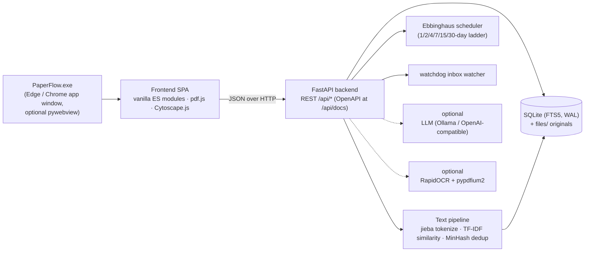

<div align="center">

# PaperFlow

**A local-first literature manager — read · search · connect · remember**

[](https://github.com/luzhijintou/paperflow/releases/latest)
[](LICENSE)
[](https://github.com/luzhijintou/paperflow/releases/latest)
[](https://www.python.org/)
[](https://github.com/luzhijintou/paperflow/stargazers)

[简体中文](./README.md) | [English](./README_EN.md)

*No installer, no account, no internet required — reading, full-text search, annotation, spaced review, and knowledge linking all happen on one laptop.*


</div>

---

## Table of Contents

- [1. What is PaperFlow?](#1-what-is-paperflow)
- [2. Positioning vs. Cloud Reference Managers](#2-positioning-vs-cloud-reference-managers)
- [3. Core Features](#3-core-features)
- [4. Getting Started](#4-getting-started)
- [5. A Recommended Research Workflow](#5-a-recommended-research-workflow)
- [6. Architecture](#6-architecture)
- [7. Privacy & Data Sovereignty](#7-privacy--data-sovereignty)
- [8. FAQ](#8-faq)
- [9. Known Limitations](#9-known-limitations)
- [10. Contributing](#10-contributing)
- [11. License](#11-license)

---

## 1. What is PaperFlow?

PaperFlow is a **local-first** literature manager: every imported PDF / EPUB becomes a node that is full-text searchable, annotatable, reviewable, and connected in a knowledge graph. It does not try to replace Zotero's citation-formatting pipeline; instead it answers a more basic question:

> Once a paper is saved into a folder, **how do the things you read get found, remembered, and recalled?**

To that end, PaperFlow ships a complete reading loop:

| Capability | Description |
| --- | --- |
| **Manage** | PDF / EPUB import (drag & drop, path, watched inbox folder), cover grid view, collections / tags / deduplication |
| **Search** | SQLite FTS5 inverted index with `jieba` Chinese segmentation; titles, authors, abstracts, and body text in one index; millisecond queries |
| **Read** | A pdf.js-powered PDF reader and a chapter-based EPUB reader; vertical scroll or paged mode |
| **Annotate** | Select-to-highlight (4 colors), notes, **bidirectional links between documents**, one-click flashcards |
| **Connect** | TF-IDF semantic similarity recommends related papers; Obsidian-style force-directed knowledge graph |
| **Remember** | Day-based spaced-repetition scheduling on the **Ebbinghaus forgetting curve** (1 / 2 / 4 / 7 / 15 / 30-day ladder) |
| **Organize** | Visual if-then rule engine, SHA-256 / MinHash smart deduplication, optional AI summaries and tagging (fully local capable) |
| **Export** | Whole-library JSON, per-paper Markdown, Obsidian, and Anki one-click export; full REST API |

All data (SQLite database + original file copies) lives in a single local `data/` folder. The app runs fully offline — no account, no telemetry, no cloud dependency. The UI is available in **Chinese and English** (Settings → Language).

## 2. Positioning vs. Cloud Reference Managers

An honest comparison — not a claim to replace anything. PaperFlow deliberately stays out of citation formatting (see [Known Limitations](#9-known-limitations)).

| Dimension | PaperFlow | Cloud managers (Zotero / EndNote etc.) |
| --- | --- | --- |
| Data location | Local `data/` folder; copying it *is* the backup | Local library + cloud sync (account required) |
| Offline use | ✅ Fully offline, zero network dependency | Mostly offline-capable; sync/account needs network |
| Chinese full-text search | ✅ jieba segmentation + FTS5, works out of the box | Supported, but segmentation quality varies by tool |
| Knowledge graph | ✅ Built in (doc–tag–link–similarity edges) | Usually plugin-based (e.g. Zotero Graph) |
| Spaced repetition | ✅ Built-in Ebbinghaus day-based scheduler | ❌ Usually none (external Anki + plugins) |
| Obsidian / Anki export | ✅ Built in | Plugin-based |
| OCR for scanned PDFs | ✅ Optional component, one-click install in Settings | ❌ Usually external tools |
| AI summary / tagging | ✅ Optional; supports fully local Ollama | Partial; mostly cloud services |
| Account / telemetry | None | Account required |
| Citation styles / Word plugin | ❌ Out of scope | ✅ Core capability |
| Price | Free, open source (MIT) | Zotero free (storage paid) / EndNote paid |

**In one sentence**: for strict citation management and collaboration, use Zotero; for a private reading workbench that **belongs only to you, requires no account, and makes everything you read searchable and reviewable**, try PaperFlow.

## 3. Core Features

### 3.1 Library

- **Import** by drag & drop / file picker / path, or drop PDFs into a watched inbox folder (watchdog + debounce) — new files are imported and indexed automatically
- **Grid / list views** with high-resolution covers (PDF first page / EPUB embedded cover), authors, year, page count, import time
- **Collections / tags / status filters** with sorting
- **Smart deduplication**: exact SHA-256, near-duplicate MinHash, and title-similarity version suggestions with one-click merge in the inbox


### 3.2 Chinese full-text search

- SQLite **FTS5** inverted index; `jieba` performs dictionary-based Chinese segmentation; mixed Chinese–English documents are fully searchable
- Titles, authors, keywords, abstracts, and body text indexed with highlighted snippets
- Fully local: at the 10,000-document scale, median query latency stays in the millisecond range

### 3.3 Close reading & annotation

- **Select text to act**: highlight (4 colors), note, create a **bidirectional link** to another paper, or generate a review card
- A searchable annotation summary view; annotations travel with Markdown / Obsidian export
- Scanned PDFs get a **transparent selectable text layer** aligned to the original page after local OCR — select, copy, and annotate just like with commercial readers


### 3.4 Knowledge graph

- Nodes: documents and tags; edges: **bidirectional links, TF-IDF similarity, and tag co-occurrence**
- Obsidian-style force-directed layout (Cytoscape.js + fcose): nodes scale with degree, hovering focuses the neighborhood and fades the rest, labels adapt to zoom
- Similarity threshold slider (15% / 30% / 50%) adds and removes edges live; search by title / tag and press Enter to focus a node
- Double-click a node to jump straight into reading


### 3.5 Ebbinghaus spaced review

- Turn any highlight or selection into a flashcard; cards are scheduled on the forgetting curve: a fixed day ladder `1 → 2 → 4 → 7 → 15 → 30`
- Four grades: **Easy** skips ahead, **Good** advances the ladder, **Hard** repeats the same day, **Forgot** returns to day 1; after the ladder, intervals grow adaptively by an ease factor
- Every grade previews the next review date; a persistent **due counter** lives in the navigation rail


### 3.6 Automation & optional intelligence

- **Rule engine**: a visual if-then editor (conditions: body text / filename / title / tags / year / type / page count…; actions: tag / collect / rename / trigger analysis) applied on import
- **AI summary / metadata / tagging** (optional): any OpenAI-compatible endpoint — Ollama for fully local inference, DeepSeek, OpenAI; without configuration the feature degrades silently
- **Local OCR** (optional): one-click install of pypdfium2 + RapidOCR (Chinese models included) into `data/pylibs` from the Settings page — no command line, no restart; streaming page-by-page recognition keeps memory flat (~1 GB peak on 300+ page scans)

### 3.7 Open data

- **Whole-library JSON export**; **per-paper Markdown export** (frontmatter / summary / annotations / backlinks)
- **Obsidian export**: notes interlinked with `[[wikilinks]]`, dropped straight into your vault
- **Anki export**: pushed to a chosen deck via AnkiConnect
- **Full REST API**: OpenAPI docs at `/api/docs`, optional API key, event webhooks

## 4. Getting Started

### 4.1 Windows build (recommended)

1. Download `PaperFlow-win64-*.zip` from [**Releases**](https://github.com/luzhijintou/paperflow/releases/latest)
2. Extract anywhere (e.g. `D:\PaperFlow`)
3. Double-click `PaperFlow.exe`

> If SmartScreen appears on first launch: click "More info → Run anyway". The binary is not code-signed (see [Known Limitations](#9-known-limitations)).

- **Requirements**: Windows 10 / 11 (64-bit). The default desktop window uses the system's Microsoft Edge in app mode — no extra dependencies
- **Uninstall**: delete the folder; no registry leftovers
- **Backup**: copying `data/` backs up everything

### 4.2 Running from source

```bash
git clone https://github.com/luzhijintou/paperflow.git
cd paperflow
pip install -r requirements.txt

# Web mode (open http://127.0.0.1:8300 in a browser)
python run.py

# Or desktop-window mode (auto-detects pywebview, falls back to an Edge/Chrome app window)
python run_desktop.py
```

The repo bundles all runtime dependencies as unpacked wheels under `deps/`, and `backend/paths.py` injects that folder into `sys.path` automatically — so it even runs on machines **without network access or pip**. Optional dependencies: `requirements-desktop.txt` (embedded window) and `requirements-ocr.txt` (OCR).

## 5. A Recommended Research Workflow

A loop that has been validated in daily use — matching the four screenshots above:

1. **Import & organize** — drop new PDFs into the inbox folder; the rule engine tags and sorts them; duplicates merge in one click
2. **Read & annotate** — highlight key claims, write notes, and create bidirectional links to older papers on the same method
3. **Make cards & review** — turn 2–3 core conclusions into flashcards per paper; clear the daily due queue with the Ebbinghaus scheduler
4. **Connect & rediscover** — when writing a review, open the graph and surface papers you read but forgot; double-click to jump back to the text
5. **Consolidate & export** — periodically export Markdown / Obsidian and merge annotations and backlinks into your long-term note system

## 6. Architecture



| Layer | Technology | Notes |
| --- | --- | --- |
| Desktop shell | Edge/Chrome `--app` mode (default); pywebview (optional) | Chromeless window with zero dependencies; embedded WebView2 optional |
| Frontend | Vanilla ES Modules, **no build step** | pdf.js (PDF rendering), Cytoscape.js + fcose (graph) |
| Backend | Python 3.13 · FastAPI · Uvicorn | Every capability exposed via REST with OpenAPI docs |
| Storage | SQLite (FTS5 + WAL) + original file copies | Single-file database; copying `data/` is a full backup |
| Text processing | jieba segmentation · TF-IDF cosine similarity · MinHash near-dup · SHA-256 exact dup | All computed locally |
| Packaging | PyInstaller (onedir) | Dependencies ship with the exe; no Python install needed |

## 7. Privacy & Data Sovereignty

- **No account, no telemetry, no forced networking**: every core feature works with the cable unplugged
- **Data portability**: `data/` = one SQLite database + original files; copy the folder at any time; exports are open JSON / Markdown
- **AI is optional**: point it at Ollama for fully local inference — your papers never leave the machine; with nothing configured, no AI call is ever made
- **API security**: optional API key; the server binds to localhost only by default

## 8. FAQ

**Where is my data, and can I lose it?**
Everything lives under `data/`: one SQLite database plus a `files/` folder of original documents. Backup = copy the folder; uninstall = delete it.

**Is it portable?**
Yes. The exe runs from a USB drive; when the directory is writable, data follows the executable.

**SmartScreen blocks the first launch?**
The app has no code-signing certificate. Click "More info → Run anyway", or run from source (4.2) if you prefer.

**Do I have to configure AI?**
No. AI summary / tagging is an optional enhancement; without it, search, annotation, the graph, and review are unaffected. For AI, plug in Ollama to stay fully local.

**What about scanned PDFs?**
Settings → OCR → one-click install (local components download into `data/pylibs`, with mirror fallback). Scanned pages then get a selectable text layer, and the text enters search and the graph.

**Is there multi-device sync?**
No built-in cloud sync — by design. You can sync `data/` with a cloud drive, but note that concurrent SQLite writes on multiple ends can cause lock conflicts; use one end at a time.

**Why is the desktop window Edge?**
The default window is the system Edge/Chrome in `--app` mode — a chromeless window with zero extra dependencies. For a true embedded window, `pip install pywebview` and the app switches automatically (WebView2).

## 9. Known Limitations

Listed honestly so you can decide whether it fits you:

- **Windows x64 build only**. The source itself is cross-platform (Python), but macOS / Linux require extra manual steps
- **No code signing**: SmartScreen will warn on first run
- **Single-machine app**: no built-in cloud sync or collaboration; syncing `data/` via cloud drives carries SQLite lock risks
- **No citation management**: BibTeX import, citation styles, and Word plugins are out of scope — leave those to Zotero / EndNote; PaperFlow focuses on the reading and knowledge-internalization stage
- **Libraries beyond ~10k documents are not stress-tested**: the thousand-document scale is validated in daily use; feedback welcome beyond that
- **v0.1.0 is an early release**: the data format may evolve — back up `data/` before upgrading

## 10. Contributing

Issues and PRs are welcome. For local development:

```bash
pip install -r requirements.txt -r requirements-dev.txt
python run.py                    # start the dev server
python tools/test_backend.py     # backend tests
```

## 11. License

[MIT](LICENSE) © 2026 PaperFlow contributors

---

<div align="center">
<sub>If PaperFlow helps your research, consider giving it a star ⭐</sub>
</div>
